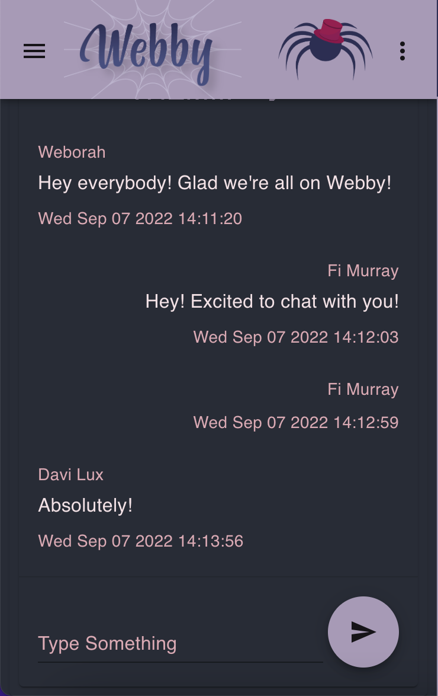
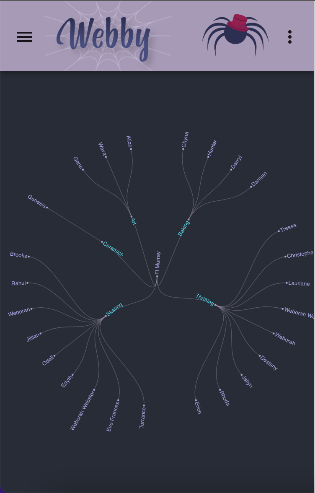

A hobby-centric social media application

## About

[Webby](https://webby-social.netlify.app) is a networking app that allows users to view an
interconnected web of themselves and other users generated from their mutual interests. Users can browse their own web and check out other users' information, choose to add them as a friend, or send them a message to plan a meetup. Use our messenger to chat with other folks, or groups of folks, to make plans! Webby strives to help people build their communities and make connections with other people through things they might be passionate about, or want to learn.

This project was created with create-react-app, as the capstone project for the Grace Hopper program at FullStack Academy.

## Technologies

- Javascript
- Firebase
- React.js
- Redux
- D3
- Geoapify
- Faker.js
- Netlify
- Material UI

## Developers

### Davi Lux
- [Github](https://github.com/davilux)
- [LinkedIn](https://www.linkedin.com/in/davilux/)
### Eve Frances
- [Github](https://github.com/L0tusPetal)
- [LinkedIn](https://www.linkedin.com/in/eve-frances/)
### Fiona Murray
- [Github](https://github.com/lavenderfi)
- [LinkedIn](https://www.linkedin.com/in/fiona-murray-dev/)
### Noelle Huchette
- [Github](https://github.com/noellehuchette)
- [LinkedIn](https://www.linkedin.com/in/noelle-huchette/)

##### We would like to thank Alec and Drew for helping us with whatever we needed, and especially to Alec for being our amazing cohort instructor.